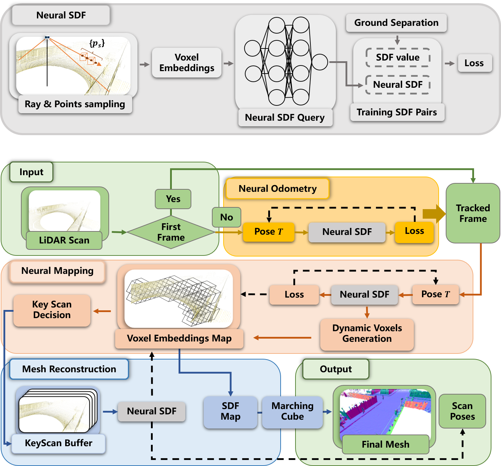
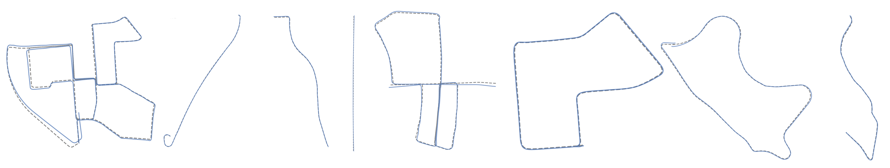

# NeRF-LOAM: Neural Implicit Representation for Large-Scale Incremental LiDAR Odometry and Mapping

This repository contains the implementation of our paper:
> **NeRF-LOAM: Neural Implicit Representation for Large-Scale Incremental LiDAR Odometry and Mapping** [PDF](https://arxiv.org/pdf/2303.10709)\
> [Junyuan Deng](https://github.com/JunyuanDeng),  [Xieyuanli Chen](https://github.com/Chen-Xieyuanli), Songpengcheng Xia, Zhen Sun, Guoqing Liu, Wenxian Yu and Ling Pei\
> If you use our code in your work, please star our repo and cite our paper.

```
announced at Tue, 21 Mar 2023 00:00:00 GMT
```

<div align=center>
 
</div>

- *Our incrementally simultaneous odometry and mapping results on Newer College dataset and KITTI dataset sequence 00.*
- *The maps is in dense with form of mesh, the red line indicate the odometry results*
- *We use the same network without traning to prove the ablitity of generalization of our design*


## Overview



**Overview of our method.** Our method is based on our neural SDF and composed of three main components:
- Neural odometry takes the pre-processed scan and optimizes the pose via back projecting the queried neural SDF; 
- Neural mapping jointly optimizes the voxel embeddings map and pose while selecting the key-scans; 
- Key-scans refined map returns SDF value and the final mesh is reconstructed by marching cube.

## Quatitative results

**The reconstructed maps**

*The qualitative result of our odometry mapping on KITTI dataset. From left upper to right bottom, we list the results of sequences 00, 01, 03, 04, 05, 09, 10.*

**The odometry results**

*The qualitative results of our odometry on KITTI dataset. From left to right, we list the results of sequences 00, 01, 03, 04, 05, 07, 09, 10. The dashed line corresponds to the ground truth and the blue line to our odometry method.*


## Data

1. Newer College real-world LiDAR dataset: [website](https://ori-drs.github.io/newer-college-dataset/download/). 

2. MaiCity synthetic LiDAR dataset: [website](https://www.ipb.uni-bonn.de/data/mai-city-dataset/).

3. KITTI dataset: [website](https://www.cvlibs.net/datasets/kitti/).

## Code

The code and usage details will be available soon.

## Contact

Any question or suggestions are welcome!

Junyuan Deng: djuney@sjtu.edu.cn and Xieyuanli Chen: xieyuanli.chen@nudt.edu.cn

## License

This project is free software made available under the MIT License. For details see the LICENSE file.
